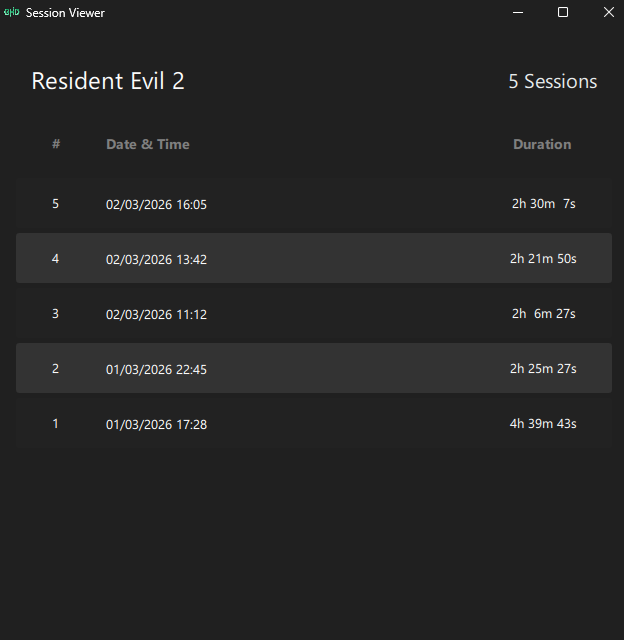

# GHD Game Launcher

An offline launcher for Games and Applications made with Qt and QML.




## Features

- Add/Edit/Remove games and applications
- Grid/List view
- Search
- Sorting based on Hours Played, Last Played and install date
- Recent activity chart
- Sessions List Viewer

## TODO

- [ ] Auto download covers (couldn't find a reliable source)
- [ ] Batch game add (read a JSON file?)
- [ ] Export/Import
- [x] Session List View
- [x] Minor glitches (switching between sort modes, etc.)
- [x] Recent activity chart in the list view

## Building

Just open the project with Qt Creator and build!

## Packing (Windows)

To pack the application first copy the built .exe file to a folder like `deploy/date/`

`cd` to that folder then run this command

```bat
windeployqt GHD_Launcher.exe --qmldir ..\..\ui\
```

Make sure you have Qt bin folder in PATH.

## Credits

- Gholamreza Dar 2026
- LLMs for parts of the project
