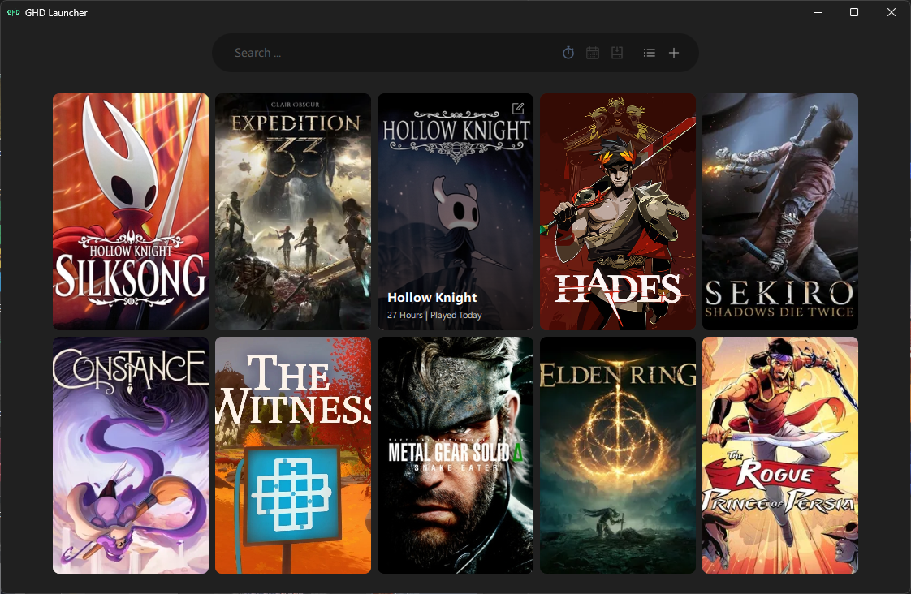
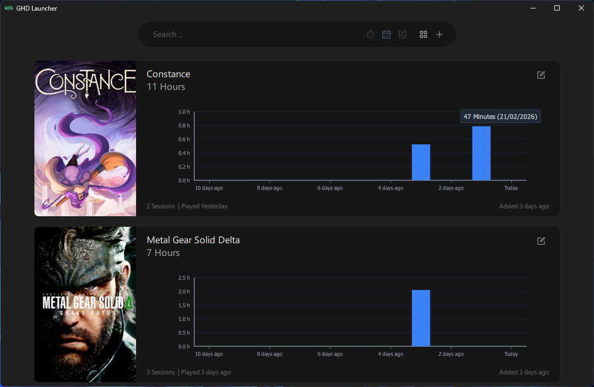

# GHD Game Launcher

An offline launcher for Games and Applications made with Qt and QML.

## Features

- Add/Edit/Remove games and applications
- Grid/List view
- Search
- Sorting based on Hours Played, Last Played and install date
- Recent activity chart

## TODO

- [ ] Auto download covers (couldn't find a reliable source)
- [x] Recent activity chart in the list view (in progress)
- [ ] Batch game add (read a JSON file?)
- [ ] Export/Import
- [ ] Minor glitches (switching between sort modes, etc.)

## Credits

- Gholamreza Dar 2026
- LLMs for parts of the project
